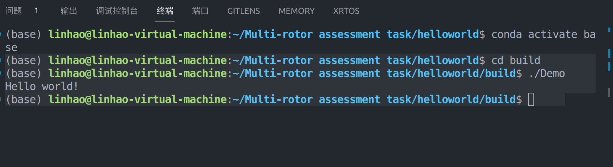
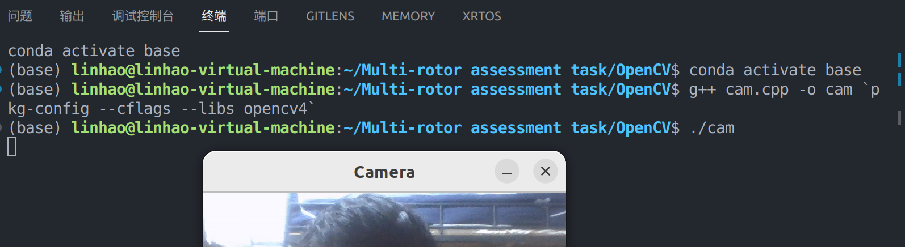
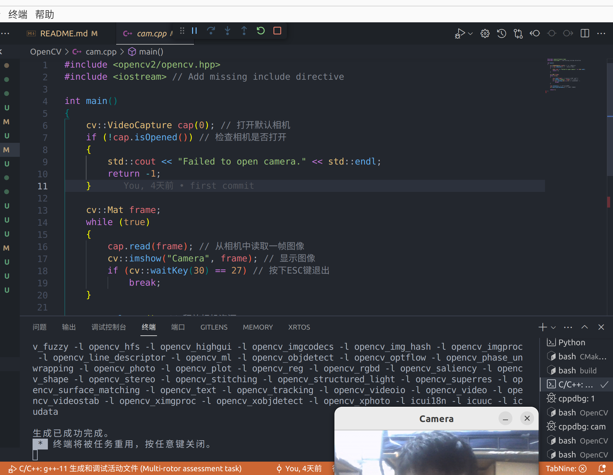
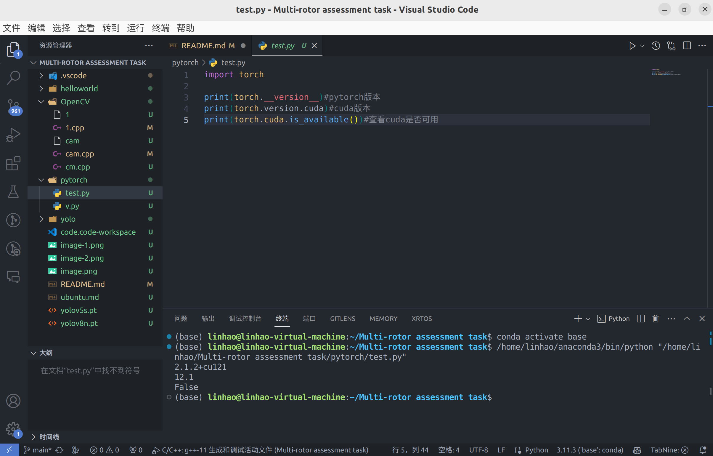
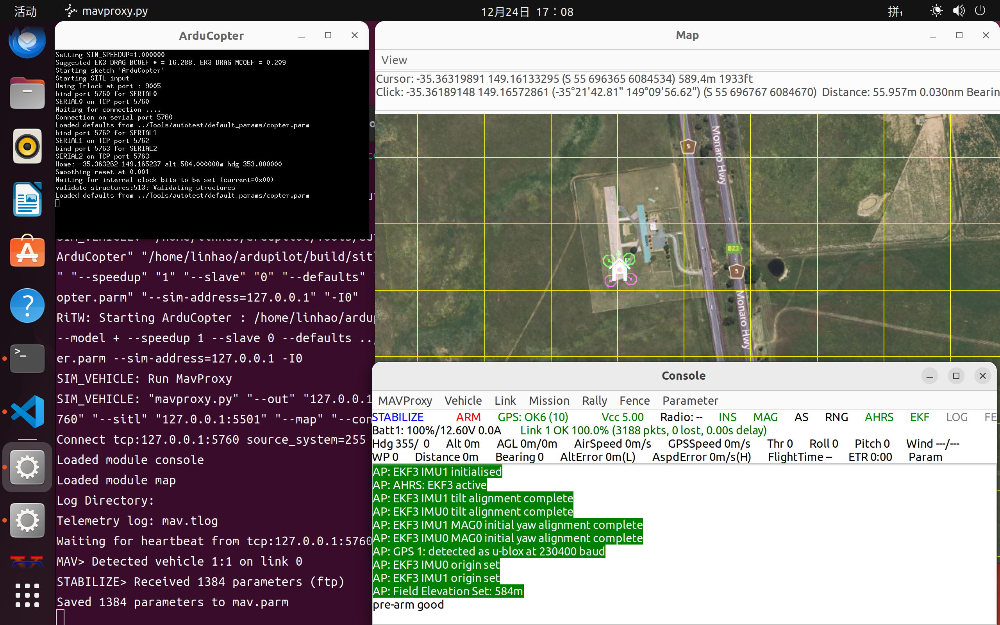

多旋翼考核任务，**上交时间为2023年12年31日23:59分**，请将git仓库的地址私发给群主。任务验收时间暂定2024年1月1日19：00，地点：西北田工作室。  
这是一个学习的过程，旨在锻炼大家自主学习和解决问题的能力 ！！！  
√—×  
# 多旋翼考核任务  
涉及知识:Linux/c++/cmake/git/python
* 注意:以下全部任务在Ubuntu系统上完成，量力而行，不要求全部完成，根据任务点给分
    
* 0． 长期任务:整个考核任务完成过程中，将使用到的知识点、遇到的报错、如何解决等整理为
学习笔记(markdown格式)
</a><div id="1"></div>
* [x] 1. <a href ="#a"> 选择虚拟机或者双系统安装Ubuntu系统【10’】，换源换输入法（使能打出中文）【5'】</a><div id="2"></div>

* [ ] 2. <a href ="#b"> 自己写一个打印"Hello Word”的函数定义在头文件(.h)里，然后在一个cpp文件中调用它(你或许需要学习g++命令或者学会编写CmakeLists.txt将它们链接到一起)【10】</a><div id="3"></div>

* [ ] 3. <a href ="#c1">编译安装或者使用包管理器安装OpenCV，自己编写代码成功调用摄像头并将窗口展示出来(c++)【15'】</a><div id="4"></div>
* [ ] 4. <a href ="#d">在github上建立自己的仓库,将完成的代码以及效果图全部传到你的仓库里,将0任务
的学习笔记作为README一起上传（使用git命令行,
学会使用.gitigignore和git lfs 用
法【10'】</a><div id="5"></div>
* [ ] 5. <a href ="#e">安装anaconda，学习虚拟环境使用方法，配置好pytorch.环境(有独显的电脑必须安装GPU版本，没有独显的可以学习白嫖 CoLab等云服务器)【10'】</a><div id="6"></div>
* [ ] 6. <a href ="#f">完成SITL仿真环境搭建，成功启动Terminal、Console、Map三个窗口(可参考教程-微信公众号苍穹四轴DIY) 【15'】</a><div id="7"></div>
* [ ] 7. <a href ="#g">了解YOLO目标检测算法，选择一个版本，跑通源码训练和检测部分【25'】</a><div id="8"></div>
---

多旋翼考核任务

涉及知识:Linux/c++/cmake/git/python
注意:以下全部任务在 Ubuntu系统上完成，量力而行，不要求全部完成，根据任务点给分0． 长期任务:整个考核任务完成过程中，将使用到的知识点、遇到的报错、如何解决等整理为
学习笔记(markdown格式)

1.选择虚拟机或者双系统安装Ubuntu系统【10'】，换源，换输入法(使能打出中文)【5'】

*安装 Ubuntu 系统时自定义分盘，将根目录和home目录的磁盘格式设为btrfs，并学习如何在 btrfs 文件系统下拍快照*

2． 自己写一个打印""Hello Word"的函数定义在头文件(.h)里，然后在一个cpp文件中调用它
(你或许需要学习g++命令或者学会编写CmakeLists.txt将它们链接到一起)【10'】3．编译安装或者使用包管理器安装OpenCV，自己编写代码成功调用摄像头并将窗口展示
出来 (c++)【15'】

*安装能使用cuda 的 OpenCV版本（编译安装 OpenCV和OpenCV_contrib)*

4．在github上建立自己的仓库，将完成的代码以及效果图全部传到你的仓库里，将0任务
的学习笔记作为README一起上传(使用git命令行，学会.gitigignore和 git lfs用法)【10】
5．安装 anaconda，学习虚拟环境使用方法，配置好 pytorch环境(有独显的电脑必须安装
GPU版本，没有独显的可以学习白嫖CoLab等云服务器)【10'】

学*习pytorch框架基本使用方法，自己写一个神经网络训练minist 数据集,使测试准确率达到95%*

6.完成SITL仿真环境搭建，成功启动Terminal、Console、Map三个窗口(可参考教程-微
信公众号苍穹四轴DIY)【15'】
7．了解YOLO目标检测算法,选择一个版本,跑通源码训练和检测部分【25'】

*使用labelme
或者labellmg 制作自己的数据集并训练，将训练好的模型部署到c++上*


##  <div id="a"></div><a href ="#1"> 任务1</a>
### 1.ubuntu系统
1. 安装程序(vmware tools)  
    * ~~拷贝目录（cp）~~

    * 解压文件(tar -zxvf 文件名 (当前位置)解压到位置)
        > tar -xzvf VMwareTools-10.3.21-14772444.tar.gz

    * ~~切换目录  
        (cd 当前目录文件夹名/相对路径   
        cd /根目录+（完整路径）  
        cd \~ [\\\~\==\home])~~
        > ~~cd vmware-tools-distrib/~~

    * 以系统管理者的身份执行指令(sudo 文件名)
        >sudo ./ vmware-install.pl  

        当有网络链接时安装成功
    
    方法二
    ```
    sudo apt upgrade
    sudo apt install open-vm-tools-desktop -y
    sudo reboot
    ```

    <a href=https://blog.csdn.net/dengjin20104042056/article/details/130545759>链接</a>


2. ubuntu网卡丢失
    ```
    sudo service NetworkManager stop
    
    sudo rm  /var/lib/NetworkManager/NetworkManager.state
    
    sudo vi /etc/NetworkManager/NetworkManager.conf 
    //打开.conf文件后，找到里面的managed，将managed=false改为managed=true。
    
    sudo service NetworkManager start
    ```

3. ubuntu文件系统根目录磁盘空间不足
    在使用Ubuntu时，可能会出现下图中的提示：这需要我们对Ubuntu根目录磁盘空间进行扩展具体步骤：
    1. 打开终端，输入下面的命令行，安装gparted管理器sudo apt-get install gparted 
    2. 安装完成后，输入下面的命令行sudo gparted打开的界面如下图所示
    3. 右键点击分区，选择调整大小/移动
    4. 增大分区后，点击调整大小
    5. 点击应用全部操作通过以上步骤就完成了对Ubuntu根目录磁盘空间的扩展
##  <div id="b"></div><a href ="#2"> 任务2</a>
### cpp
1. 编辑器，编译器（IDE）
#### vscode
1. 下载linux deb x64版（文件名code_1.78.2-1683731010_amd64.deb）到Download目录[下载链接](https://code.visualstudio.com/#alt-downloads)，安装   双击deb安装包安装[教程链接](https://blog.csdn.net/m0_56484847/article/details/130831817)
    1. 在终端下进入Dowload目录
       ~~```cd Downloads/```（查找download文件夹）~~（cd 下载）  
    2. 执行本地安装命令
       ```sudo dpkg -i code_1.85.0-1701902998_amd64.deb ``` 
          * deb文件是linux发行版debian系统的安装包格式，还有像基于debian系统的发型版ubuntu等系统就是使用的deb格式安装包，我们可以使用dpkg命令进行安装管理这些deb安装包文件。
          1. 使用dpkg命令进行安装。 
           ```sudo dpkg -i deb文件名 ``` 
           2. 根据经验，通常情况下会报依赖关系的错误，我们可以使用以下的命令修复安装。  
           ```sudo apt-get install -f```
           3. 卸载软件
           如果要卸载安装的应用我们通过```sudo dpkg -l```查看已经安装的软件，并找到自己的安装的软件名。 
           最后使用```sudo dpkg -r 软件名```进行卸载。
    3. 执行code命令即可打开vscode软件
       code
       
2. 安装vscode插件  
    我们需要按照的插件有下面几个：
    1. Chinese(Simplified)，即中文环境显示，非常方便。
    2. C/C++，这个是必须的，可对 C 和 C++ 代码进行调试支持、智能提示、代码重构、代码格式化等重要基础功能
    3. C/C++ Snippets，即 C/C++重用代码块;提供了许多常见的代码片段，例如if/else语句、循环语句、函数定义、数组操作等等，C/C++ Snippets插件绝对是一个值得安装和使用的插件。
    4. C/C++ Advanced Lint,即 C/C++静态检测 ；可以在编译前检查代码中的潜在错误，并提供错误提示和建议。它还支持多种编译器，包括 GCC、Clang 和 MSVC。
    5. Code Runner，即代码运行。
    6. Include AutoComplete，即自动头文件包含。
    7. Rainbow Brackets，彩虹花括号，有助于阅读代码。
    8. One Dark Pro， VSCode 的主题。
    9. GBKtoUTF8，将 GBK 转换为 UTF8。
    10. ARM，即支持 ARM 汇编语法高亮显示。
    11. vscode-icons， VSCode 图标插件，主要是资源管理器下各个文件夹的图标。
    12. compareit，比较插件，可以用于比较两个文件的差异。
    13. DeviceTree，设备树语法插件。
    14. TabNine，一款 AI 自动补全插件
    15. Code Autocomplete，也可自动补全
    16.  cmake,提供cmake语法编译

3. 通过VSCode对C++代码进行编译、调试[教程](https://blog.csdn.net/hypc9709/article/details/129413482)
    1. VSCode中的"C/C++插件"已安装（直接在VSCode扩展商店搜索"C++"即可）
    2. 确保g++编译器和gdb调试器已安装。可以在终端查看g++是否已安装
    查看版本```g++ -v``` 
    安装 ```sudo apt-get update
    sudo apt get install build-essential gdb```
    3. 配置tasks.json  
    调试c++文件，选择"C/C++: g++ 生成活动文件”，vscode会自动生成一个.vscode文件夹和 tasks.json文件。
    4. 执行编译  
    右上角三角运行/<kbd>ctrl</kbd>+<kbd>shift</kbd>+<kbd>B</kbd>/菜单中选择运行：Terminal -> Run Build Task
    5. 调试 
    .cpp中设断点，右上角三角调试 
    * 如果想要在其他的文件夹下复用这种配置，只需要把tasks.json和launch.json文件复制到新文件夹下的.vscode目录下，然后根据需要改变对应的源文件和可执行文件的名称即可。
#### c++
1. 程序结构[sbCSDN](https://blog.csdn.net/m0_62692838/article/details/130301872)
    * 命名空间
        * C++解决了C语言中命名冲突的问题，C++使用namespace-命名空间（关键字）来解决命名冲突的问题，使用namespace定义一个域，用域进行隔离。
        * 定义命名空间,需要使用到namespace关键字,后面跟命名空间的名字,然后接一对{}即可,{}中即为命名空间的成员。
        ```cpp
        #include<stdio.h>
        #include<stdlib.h>
        namespace A
        {
        int rand = 0;
        }
        int main ( ){
        printf ( "%d\n" , rand ) ;
        return 0;
        }
        ```
        1. 命名空间中可以定义变量/函数/类型。
        2. 命名空间可以嵌套。
        3. 同一个工程中允许存在多个相同名称的命名空间,编译器最后会合成同一个命名空间中。
        *  域作用限定符  
              ```::```, ::加在变量的前面，表示去::左边的域访问。注意：如果左边的域是空白，就代表是全局域。
             ```::a
             A::a```
        * ```using namespace A```;将命名空间域A展开，但是展开就相当于将A中的内容放在全局中
        * C++标准库  
            c++标准库中的函数或者对象都是在**命名空间std**中定义的,所以我们要使用标准库中的函数或者对象都要用std来限定。   
            把C++标准库中的函数或者对象都用std这个命名空间包起来了，为了和旧的库进行区分，就定义了新的标准，不再使用.h了。
        * 输入输出函数  
           cout相当于输出函  数，cin相当于输入函数，endl相当于换行，注意cout和cin都可以连续一行插入或输出多个变量，会自动识别类型。
            ```cpp
            #include<iostream>  
            cin >> x >> d;
            cout << "hello" << x<<" "<< d<<endl
            ``` 

        * 缺省参数  
            声明函数的时候可以让最右边的连续若干个参数有缺省值，在调用函数的时候，如果不写相应位置的参数，则调用的参数就为缺省值。

    * 编译 & 执行 C++ 程序
    ```c++
    include  // 包含iostream头文件
    using namespace std; // 使用命名空间std，可以避免使用std::cout等冗长的操作
    int main() { // C++程序的入口函数
        cout << "Hello, world!\n"; // 输出Hello, world!的提示信息
        return 0; // 返回0，表示程序执行正常结束
    }
    ```
2. 头文件
    * 头文件(.h)  
    * 在写头文件时需要注意，在开头和结尾处必须按照如下样式加上预编译语句（如下）：
    ```cpp
    #ifndef CIRCLE_H
    #define  CIRCLE_H

    // 你的代码写在这里
    class  Circle
    {
    private:
        double r;//半径
    public:
        Circle();//构造函数
        Circle(double R);//构造函数
        double Area();//求面积函数
    } ;

    #endif
    ```
    这样做是为了防止重复编译，不这样做就有可能出错。
    * 具体实现(.cpp)  
        在源文件夹里新建一个Circle.cpp的文件，它的内容如下：
        ```cpp
        #include  " Circle.h "

        Circle::Circle()
        {
            this->r=5.0;
        }

        Circle::Circle( double  R)
        {
            this->r=R;
        }

        double  Circle:: Area()
        {
            return 3.14*r*r;
        } 
        ```
    * 源文件(.cpp)  
    main.cpp来测试我们写的Circle类，它的内容如下：
    ```cpp
    #include  < iostream >  
    #include  " Circle.h "
    using   namespace  std;

     int  main()
    {
        Circle c(3);
        cout<<"Area="<<c.Area()<<endl;
        return 1;
    }
    ```


3. 把源代码保存在一个文件中，以及如何编译并运行它。下面是简单的步骤：

    * 打开一个文本编辑器，添加上述代码。
    * 保存文件为 hello.cpp。
    * 打开命令提示符，进入到保存文件所在的目录。
    * 键入 '```g++ hello.cpp ```'，输入回车，编译代码。如果代码中没有错误，命令提示符会跳到下一行，并生成 a.out 可执行文件。
    * 现在，键入 '```./a.out```' 来运行程序。
    * 您可以看到屏幕上显示 ' Hello World
     
dtyjno: @workspace /fix 

---

dtyjno: 写一个打印"Hello Word”的函数定义在头文件(.h)里，然后在一个cpp文件中调用它(你或许需要学习g++命令或者学会编写CmakeLists.txt将它们链接到一起)

GitHub Copilot: 首先，我们需要在头文件中声明一个函数，然后在cpp文件中定义这个函数。最后，我们在另一个cpp文件中调用这个函数。

以下是这个过程的详细步骤：

1. 创建一个头文件（例如，`hello.h`）并声明函数：

```c
// hello.h
#ifndef HELLO_H
#define HELLO_H

void print_hello();

#endif // HELLO_H
```

2. 在一个cpp文件（例如，`hello.cpp`）中包含头文件并定义函数：

```cpp
// hello.cpp
#include <iostream>
#include "hello.h"

void print_hello() {
    std::cout << "Hello World" << std::endl;
}
```

3. 在另一个cpp文件（例如，`main.cpp`）中包含头文件并调用函数：

```cpp
// main.cpp
#include "hello.h"

int main() {
    print_hello();
    return 0;
}
```

4. 使用g++命令编译并链接这两个cpp文件：

```bash
g++ -o main hello.cpp main.cpp
```

这个命令将生成一个名为`main`的可执行文件。运行这个文件将打印出"Hello World"。

注意：这些文件应该都在同一个目录下，否则你需要在包含头文件时指定正确的路径。

要使用CMake编译和链接这两个文件，你需要创建一个名为`CMakeLists.txt`的文件，该文件描述了构建过程。

以下是一个简单的`CMakeLists.txt`文件：

```cmake
cmake_minimum_required(VERSION 3.10)
project(HelloWorld)

set(CMAKE_CXX_STANDARD 11)

add_executable(HelloWorld main.cpp hello.cpp)
```

这个`CMakeLists.txt`文件做了以下几件事：

1. 检查你的CMake版本是否至少为3.10。
2. 创建一个名为`HelloWorld`的项目。
3. 设置C++标准为C++11。
4. 添加一个可执行文件`HelloWorld`，它由`main.cpp`和`hello.cpp`构建。

然后，你可以在命令行中运行以下命令来构建项目：

```bash
mkdir build
cd build
cmake ..
make
```

这些命令做了以下几件事：

1. 创建一个名为`build`的目录，用于存放构建过程中生成的文件。
2. 进入`build`目录。
3. 运行CMake以生成Makefile。
4. 运行Make以构建项目。

最后，你可以运行生成的可执行文件：

```bash
./HelloWorld
```

这将打印出"Hello World"。

---
#### [cmake](https://www.coonote.com/linux-note/cmake-quick-start.html)
1. 终端输入  
    #创建并进入build目录
    mkdir build && cd build

    #构建当前目录
    cmake ..

    #使用cmake生成的makefile编译得到可执行文件
    make


    ```
    linhao@linhao-virtual-machine:~/code$ cd helloworld
    linhao@linhao-virtual-machine:~/code/helloworld$ mkdir build
    linhao@linhao-virtual-machine:~/code/helloworld$ cd build
    linhao@linhao-virtual-machine:~/code/helloworld/build$ cmake ..
    -- The C compiler identification is GNU 11.4.0
    -- The CXX compiler identification is GNU 11.4.0
    -- Detecting C compiler ABI info
    -- Detecting C compiler ABI info - done
    -- Check for working C compiler: /usr/bin/cc - skipped
    -- Detecting C compile features
    -- Detecting C compile features - done
    -- Detecting CXX compiler ABI info
    -- Detecting CXX compiler ABI info - done
    -- Check for working CXX compiler: /usr/bin/c++ - skipped
    -- Detecting CXX compile features
    -- Detecting CXX compile features - done
    -- Configuring done
    -- Generating done
    -- Build files have been written to: /home/linhao/code/helloworld/build
    linhao@linhao-virtual-machine:~/code/helloworld/build$ make
    [ 25%] Building CXX object CMakeFiles/printhello.dir/libHelloWorld.cpp.o
    [ 50%] Linking CXX static library libprinthello.a
    [ 50%] Built target printhello
    [ 75%] Building CXX object CMakeFiles/Demo.dir/useHello.cpp.o
    [100%] Linking CXX executable Demo
    [100%] Built target Demo
    linhao@linhao-virtual-machine:~/code/helloworld/build$ ./Demo
    Hello world!
    ```
2. cpp  
    问题：HelloWorld()--Hallowarld（）

### 结果

tree 命令以树状图列出目录的内容。
语法

    tree [选项] [参数]
选项
列表选项

    -a：显示所有文件和目录。


```
helloworld
├── build
│   ├── CMakeCache.txt
│   ├── CMakeFiles
│   │   ├── 3.22.1
│   │   │   ├── CMakeCCompiler.cmake
│   │   │   ├── CMakeCXXCompiler.cmake
│   │   │   ├── CMakeDetermineCompilerABI_C.bin
│   │   │   ├── CMakeDetermineCompilerABI_CXX.bin
│   │   │   ├── CMakeSystem.cmake
│   │   │   ├── CompilerIdC
│   │   │   │   ├── a.out
│   │   │   │   ├── CMakeCCompilerId.c
│   │   │   │   └── tmp
│   │   │   └── CompilerIdCXX
│   │   │       ├── a.out
│   │   │       ├── CMakeCXXCompilerId.cpp
│   │   │       └── tmp
│   │   ├── cmake.check_cache
│   │   ├── CMakeDirectoryInformation.cmake
│   │   ├── CMakeOutput.log
│   │   ├── CMakeTmp
│   │   ├── Demo.dir
│   │   │   ├── build.make
│   │   │   ├── cmake_clean.cmake
│   │   │   ├── compiler_depend.make
│   │   │   ├── compiler_depend.ts
│   │   │   ├── DependInfo.cmake
│   │   │   ├── depend.make
│   │   │   ├── flags.make
│   │   │   ├── link.txt
│   │   │   ├── progress.make
│   │   │   ├── useHello.cpp.o
│   │   │   └── useHello.cpp.o.d
│   │   ├── Makefile2
│   │   ├── Makefile.cmake
│   │   ├── printhello.dir
│   │   │   ├── build.make
│   │   │   ├── cmake_clean.cmake
│   │   │   ├── cmake_clean_target.cmake
│   │   │   ├── compiler_depend.make
│   │   │   ├── compiler_depend.ts
│   │   │   ├── DependInfo.cmake
│   │   │   ├── depend.make
│   │   │   ├── flags.make
│   │   │   ├── libHelloWorld.cpp.o
│   │   │   ├── libHelloWorld.cpp.o.d
│   │   │   ├── link.txt
│   │   │   └── progress.make
│   │   ├── progress.marks
│   │   └── TargetDirectories.txt
│   ├── cmake_install.cmake
│   ├── Demo
│   ├── libprinthello.a
│   └── Makefile
├── CMakeLists.txt
├── libHelloWorld.cpp
├── libHelloWorld.h
└── useHello.cpp
```
├── [CMakeLists.txt](helloworld/CMakeLists.txt)
```cmake
#指定运行此配置文件所需的 CMake 的最低版本。
cmake_minimum_required(VERSION 3.0.0)
#设置项目的名称，同时会自动生成 PROJECT_NAME 变量，
#使用 ${PROJECT_NAME} 即可访问到 hello_cmake。
project(hello_cmake)

#设置c++标准为c++11
set(CMAKE_CXX_STANDARD 11)

#include(CTest)
# 启用测试
#enable_testing()

# 构建一个 CPack 安装包
#include (InstallRequiredSystemLibraries)
#set (CPACK_RESOURCE_FILE_LICENSE
#  "${CMAKE_CURRENT_SOURCE_DIR}/License.txt")
#set (CPACK_PACKAGE_VERSION_MAJOR "${Demo_VERSION_MAJOR}")
#set (CPACK_PACKAGE_VERSION_MINOR "${Demo_VERSION_MINOR}")
#include(CPack)

#-----------------------------------

# 查找目录下的所有源文件,并将名称保存到 DIR_SRCS 变量
#aux_source_directory(. DIR_SRCS)
#--
#set(DIR_SRCS
#    usehello.cpp
#    libHelloWorld.cpp
#)

#=======================
# 查找当前目录下的所有源文件
# 并将名称保存到 DIR_LIB_SRCS 变量
#aux_source_directory(. DIR_LIB_SRCS)

# 指定生成 MathFunctions 链接库
#add_library (printhello ${DIR_LIB_SRCS})
# 添加 hello 子目录
#add_subdirectory(hello)
#=======================

# 指定生成 MathFunctions 链接库
add_library (printhello libHelloWorld.cpp)

#一个参数是可执行文件名，第二个参数是要编译的源文件列表。这里将名为 main.cpp 的源文件编译成一个名称为 hello_cmake 的可执行文件。
add_executable(Demo useHello.cpp)
# 添加链接库
target_link_libraries(Demo printhello)

#------------------------------------
# 查找目录下的所有源文件
# 并将名称保存到 DIR_SRCS 变量
#aux_source_directory(. DIR_SRCS)

# 指定生成目标
#add_executable(${PROJECT_NAME} ${DIR_SRCS})
```
├── [libHelloWorld.cpp](helloworld/libHelloWorld.cpp)
```cpp
#include<iostream>
#include "libHelloWorld.h"
using namespace std;

void printhello()
{
    cout << "Hello world!" << endl;
}
```
├── [libHelloWorld.h](helloworld.cpp)
```cpp
#ifndef LIBHALLOWORLD_H_
#define LIBHALLOWORLD_H_

void printhello();

#endif
```
└── [useHello.cpp](helloworld/useHello.cpp)
```cpp
#include "libHelloWorld.h"
int main(){
    printhello();
    return 0;
}
```
Demo:


##  <div id="c1"></div><a href ="#3">编译安装或者使用包管理器安装OpenCV，自己编写代码成功调用摄像头并将窗口展示出来(c++)【15'】</a>
### 下载安装
https://opencv.org/get-started/
https://docs.opencv.org/4.x/d7/d9f/tutorial_linux_install.html


Build core modules
```
# Install minimal prerequisites (Ubuntu 18.04 as reference)
sudo apt update && sudo apt install -y cmake g++ wget unzip
# Download and unpack sources
wget -O opencv.zip https://github.com/opencv/opencv/archive/4.x.zip
unzip opencv.zip
# Create build directory
mkdir -p build && cd build
# Configure
cmake  ../opencv-4.x
# Build
cmake --build .


sudo make install

pkg-config --modversion opencv  


```
https://blog.csdn.net/logani/article/details/128361925

1. ubuntu vscode无法打开源文件opencv2  

回答: 当编译时出现"fatal error: opencv2/opencv.hpp: No such file or directory"的错误时，这意味着编译器无法找到opencv2/opencv.hpp头文件。[1]解决这个问题的方法是将opencv2文件夹链接到include文件夹下，可以使用以下命令进行链接：sudo ln -s /usr/include/opencv4/opencv2 /usr/include/。[2]这样做可以让编译器能够找到所需的头文件。另外，还可以将opencv2文件夹拷贝到自己的include文件夹中，这也可以解决找不到头文件的问题。[2]这样做可以确保编译器能够正确地找到opencv2/opencv.hpp头文件。如果在编译过程中出现其他错误，比如"LNK2019 无法解析的外部符号"，这可能是由于链接错误导致的。[3]在这种情况下，您可能需要检查您的链接设置和库文件路径是否正确。


2. 引用[.reference_title]

* 查找opencv版本  
pkg-config --modversion opencv  

这个错误表明`pkg-config`在其搜索路径中找不到`opencv`包。`pkg-config`是一个帮助你在编译阶段找到库的工具。你需要将包含`opencv.pc`文件的目录添加到`PKG_CONFIG_PATH`环境变量中。

你可以使用以下命令来查找`opencv.pc`文件的位置：

```bash
sudo find / -name "opencv.pc"
```

假设你找到的`opencv.pc`文件路径为`/usr/local/lib/pkgconfig/opencv.pc`，你可以使用以下命令将其添加到`PKG_CONFIG_PATH`环境变量：

```bash
export PKG_CONFIG_PATH=$PKG_CONFIG_PATH:/usr/local/lib/pkgconfig
```

然后，你可以使用`pkg-config`来获取OpenCV的编译和链接标志：

```bash
g++ `pkg-config --cflags --libs opencv` -o cam cam.cpp
```

请注意，你可能需要根据你的OpenCV安装和系统环境来调整这些命令。

3. [ WARN:0@0.007] global cap_v4l.cpp:997 open VIDEOIO(V4L2:/dev/video0): can't open camera by index
[ERROR:0@0.012] global obsensor_uvc_stream_channel.cpp:156 getStreamChannelGroup Camera index out of range
terminate called after throwing an instance of 'cv::Exception'
  what():  OpenCV(4.8.0-dev) /home/linhao/opencv-4.x/modules/highgui/src/window.cpp:971: error: (-215:Assertion failed) size.width>0 && size.height>0 in function 'imshow'


这个错误表明OpenCV试图打开的摄像头设备（在这个例子中是设备0）无法打开。这可能是因为设备不存在，或者设备已经被其他进程占用。

你可以尝试以下方法来解决这个问题：

   1. 确保你的摄像头设备已经正确连接并且可以被你的系统识别。你可以使用`ls /dev/video*`命令来查看你的系统中的摄像头设备。

   2. 确保没有其他进程正在使用摄像头。你可以使用`lsof /dev/video0`命令来查看是否有其他进程正在使用设备0。

   3. 尝试使用其他设备索引来打开摄像头。如果你有多个摄像头设备，它们的设备索引可能是0、1、2等。

   此外，错误信息中的`size.width>0 && size.height>0 in function 'imshow'`表明你试图显示一个没有有效尺寸的图像。这可能是因为摄像头没有正确打开，所以没有读取到有效的图像帧。你需要在调用`imshow`之前检查图像帧是否有效。

g++ test2.cpp -o test2 `pkg-config --cflags --libs opencv4`  
./test2

 --cflags --libs opencv4`  
./test2
terminate called after throwing an instance of 'cv::Exception'
  what():  OpenCV(4.8.0-dev) /home/linhao/opencv-4.x/modules/highgui/src/window.cpp:1272: error: (-2:Unspecified error) The function is not implemented. Rebuild the library with Windows, GTK+ 2.x or Cocoa support. If you are on Ubuntu or Debian, install libgtk2.0-dev and pkg-config, then re-run cmake or configure script in function 'cvShowImage'

  这个错误表明你的OpenCV库没有正确地构建GUI支持。OpenCV的`imshow`函数需要一个GUI后端来显示图像，这通常是Windows、GTK+ 2.x或Cocoa。

在Ubuntu或Debian上，你需要安装`libgtk2.0-dev`和`pkg-config`，然后重新构建OpenCV。你可以按照以下步骤来操作：

   1. 安装必要的包：

   ```bash
   sudo apt-get install -y libgtk2.0-dev pkg-config
   ```

   2. 重新构建OpenCV。首先，你需要进入到你的OpenCV源代码目录，然后运行以下命令：

   ```bash
   mkdir build
   cd build
   cmake ..
   sudo make
   sudo make install
   ```

这些命令将在你的OpenCV源代码目录中创建一个新的`build`目录，然后在这个目录中构建OpenCV。`cmake ..`命令将生成Makefile，`make`命令将编译OpenCV，`sudo make install`命令将安装OpenCV。

请注意，你可能需要根据你的OpenCV安装和系统环境来调整这些命令。


Code Runner会为多种编程语言预先写好一下编译执行或者解释执行的代码，当然，由于我们这边花里胡哨需要一堆的额外编译参数，所以我们需要去修改Code Runner的默认参数，按下Ctrl + 逗号，或者点击左下角的齿轮按钮点击设置。然后搜索code runner，点击红框框框中的选项的“在setting.json中编辑”链接，如下图：


找到cpp选项，没错，我们要修改code runner对所有的后缀为.cpp的文件的默认执行动作：


可以看到，默认的编译指令就是裸的hhh，我们需要在其中加上必要的编译参数。直接将"cpp"这个键值参数改为如下就行：

"```cd $dir && g++ $fileName -o $fileNameWithoutExt -std=c++14 -I D:\\MinGW\\mingw64\\include -lopencv_core452 -lopencv_imgcodecs452 -lopencv_imgproc452 -lopencv_calib3d452 -lopencv_dnn452 -lopencv_features2d452 -lopencv_flann452 -lopencv_gapi452 -lopencv_highgui452 -lopencv_ml452 -lopencv_objdetect452 -lopencv_photo452 -lopencv_stitching452 -lopencv_video452 -lopencv_videoio452 && $dir$fileNameWithoutExt"```
改完之后一大长条：


4. 问题：/usr/bin/ld: cannot find -lhdf5
csdn
Linux编译opencv4.7报错“/usr/bin/ld: cannot find -lopencv_shape”
VScode编译中opencv的undefined reference 问题
一般来说，undefined reference to cv:: 等的问题是关于编译时依赖文件的问题，应该将包含库的路径弄好了就没问题（至少我是这样，而且网上对于具体问题应该有更具体的解决方法的文章，这个文章主要是针对Undefined Reference to cv::Mat::updateContinuityFlag()。

具体出错界面
CMakeFiles/test.dir/src/imageProcess.cpp.o: In function `cv::Mat::Mat(int, int, int, void*, unsigned long)':
/usr/local/include/opencv2/core/mat.inl.hpp:521: undefined reference to `cv::Mat::updateContinuityFlag()'

问题所在：在经过上网查找搜索以后，发现应该就是opencv版本的问题，updateContinuityFlag函数只在opencv 3.4.2及其最新版本中存在，而我使用的是Ubuntu 18.04中自带的opencv包，所以应该就是把opencv升级就好了。但是我在安装完opencv 3.4.2新版本之后，发现还是有问题，编译依然不行，经过一番挣扎后，就有了下面的解决过程，仅供参考，只是记录一下我的过程。

解决过程
1.下载安装opencv 3.4.2
（如果可以的话，试试先卸载老版本再安装新版本，不过注意删除库与其他库的依赖关系）
安装新版本，我选择的是opencv 3.4.2, 主要参考了以下文章完成了安装
链接：https://blog.csdn.net/qq_32408773/article/details/83346816
　　　https://blog.csdn.net/baidu_34971492/article/details/81665538
PS:检查自己的opencv版本可以在终端输入pkg-config opencv --modversion
　　查看linux下的opencv安装库pkg-config opencv --libs

2.修改CmakeLists.txt
参考：https://github.com/jhu-lcsr/handeye_calib_camodocal/issues/22
首先我只是修改了编译出错的cpp文件的依赖，将find_package(OpenCV REQUIRED)改为find_package(OpenCV 3.4.２ REQUIRED)，但是还是编译错误，后来发现应该要在文件最开始描述依赖文件时就要修改

3.再次编译
再次编译，没有错误了，但是有一个warning

/usr/bin/ld: warning: libopencv_imgproc.so.3.4, needed by /usr/local/lib/libopencv_highgui.so.3.4.2, may conflict with libopencv_imgproc.so.3.2
/usr/bin/ld: warning: libopencv_core.so.3.4, needed by /usr/local/lib/libopencv_highgui.so.3.4.2, may conflict with libopencv_core.so.3.2

经查找是因为opencv新版本和旧版本的冲突问题
（参考：https://blog.csdn.net/quantum7/article/details/88908071）
由于怕删除其余库所以我没敢直接卸载（看个人情况吧
于是我就去修改了一下include路径，使其只链接到opencv3.4.2, 编译成功！

---

5. 1

https://blog.csdn.net/qq_40199447/article/details/109309186
在这里插入图片描述
解决方法：

cd /usr/local/lib
sudo mkdir pkgconfig
cd pkgconfig
sudo gedit opencv.pc

输入

prefix=/usr/local
exec_prefix=${prefix}
includedir=${prefix}/include
libdir=${exec_prefix}/lib

Name: opencv
Description: The opencv library
Version:4.4.0
Cflags: -I${includedir}/opencv4
Libs: -L${libdir} -lopencv_shape -lopencv_stitching -lopencv_objdetect -lopencv_superres -lopencv_videostab -lopencv_calib3d -lopencv_features2d -lopencv_highgui -lopencv_videoio -lopencv_imgcodecs -lopencv_video -lopencv_photo -lopencv_ml -lopencv_imgproc -lopencv_flann  -lopencv_core
~                                               


6. 1
c/c++ runner  
```
setting.json  
        "cpp": "cd $dir && g++ $fileName -o $fileNameWithoutExt -I g++ your_source_file.cpp -o output_file -I /path/to/opencv/include -L /path/to/opencv/libs -lopencv_core -lopencv_highgui -lopencv_videoio -lopencv_core452 -lopencv_imgcodecs452 -lopencv_imgproc452 -lopencv_calib3d452 -lopencv_dnn452 -lopencv_features2d452 -lopencv_flann452 -lopencv_gapi452 -lopencv_highgui452 -lopencv_ml452 -lopencv_objdetect452 -lopencv_photo452 -lopencv_stitching452 -lopencv_video452 -lopencv_videoio452 && $dir$fileNameWithoutExt",
```

7. cc1plus: fatal error: your_source_file.cpp: 没有那个文件或目录
compilation terminated.

https://blog.csdn.net/jiaken2660/article/details/117034123

task.json
"-g",
                "-std=c++11",
                "${workspaceRoot}/src/*.cpp",
                "-o",
                "test",
                "-I",
                "/usr/local/include",
                "-I",
                "${workspaceRoot}/include",
                "-I",
                "/usr/local/include/opencv4",
                "-I",
                "/usr/local/include/opencv4/opencv2",
                "-I",
                "/home/jiaken2660/Qt5.9.9/5.9.9/gcc_64/include",
                "-L",
                "/usr/local/lib",
                "-L",
                "/home/jiaken2660/Qt5.9.9/5.9.9/gcc_64/lib",
                "-l",
                "opencv_aruco",
                "-l",
                "opencv_bgsegm",
                "-l",
                "opencv_bioinspired",
                "-l",
                "opencv_calib3d",
                "-l",
                "opencv_ccalib",
                "-l",
                "opencv_core",
                "-l",
                "opencv_datasets",
                "-l",
                "opencv_dnn_objdetect",
                "-l",
                "opencv_dnn",
                "-l",
                "opencv_dpm",
                "-l",
                "opencv_face",
                "-l",
                "opencv_features2d",
                "-l",
                "opencv_flann",
                "-l",
                "opencv_freetype",
                "-l",
                "opencv_fuzzy",
                "-l",
                "opencv_hfs",
                "-l",
                "opencv_highgui",
                "-l",
                "opencv_imgcodecs",
                "-l",
                "opencv_img_hash",
                "-l",
                "opencv_imgproc",
                "-l",
                "opencv_line_descriptor",
                "-l",
                "opencv_ml",
                "-l",
                "opencv_objdetect",
                "-l",
                "opencv_optflow",
                "-l",
                "opencv_phase_unwrapping",
                "-l",
                "opencv_photo",
                "-l",
                "opencv_plot",
                "-l",
                "opencv_reg",
                "-l",
                "opencv_rgbd",
                "-l",
                "opencv_saliency",
                "-l",
                "opencv_shape",
                "-l",
                "opencv_stereo",
                "-l",
                "opencv_stitching",
                "-l",
                "opencv_structured_light",
                "-l",
                "opencv_superres",
                "-l",
                "opencv_surface_matching",
                "-l",
                "opencv_text",
                "-l",
                "opencv_tracking",
                "-l",
                "opencv_videoio",
                "-l",
                "opencv_video",
                "-l",
                "opencv_videostab",
                "-l",
                "opencv_xfeatures2d",
                "-l",
                "opencv_ximgproc",
                "-l",
                "opencv_xobjdetect",
                "-l",
                "opencv_xphoto",
                "-l",
                "icui18n",
                "-l",
                "icuuc",
                "-l",
                "icudata"

8. /usr/bin/ld: 找不到 -lopencv_xfeatures2d: 没有那个文件或目录  
删除tasks.json中“-l”,“opencv_xfeatures2d",

9. Failed to open camera.
找不到摄像机   
Vmware右下角单击摄像头图标，连接失败。  
windows中任务管理器摄像头禁用再打开，Vmware中打开选择连接到虚拟机。

10. 版本切换
第一个表示自动寻找系统库里版本4以上的，第二个表示找系统库里的最低版本。

find_package(OpenCV 4 REQUIRED)
或者
find_package(OpenCV REQUIRED)


环境变量管理

添加到系统环境变量
修改~/.bashrc：

sudo gedit ~/.bashrc

像下面这样加入新的内容：

##OpenCV_4.4.0
#export PKG_CONFIG_PATH= /usr/local/opencv/opencv4.4.0/lib/pkgconfig
#export LD_LIBRARY_PATH= /usr/local/opencv/opencv4.4.0/lib

##OpenCV_3.4.2
#export PKG_CONFIG_PATH= /usr/local/opencv/opencv3.4.2/lib/pkgconfig
#export LD_LIBRARY_PATH= /usr/local/opencv/opencv3.4.2/lib

新加入OpenCV版本或者暂时不使用的OpenCV版本的建议注释掉。
对需要使用OpenCV_4.4.0，就可以把上面的#去掉。

每次切换后，都需要更新~/.bashrc

source ~/.bashrc 


查询OpenCV版本

pkg-config --modversion opencv
pkg-config --modversion opencv4

### OpenCV基础入门【C++语言】
运行：  
 g++ test2.cpp -o test2 `pkg-config --cflags --libs opencv4`  
./test2

### 结果
```sh
OpenCV
├── 1
├── 1.cpp
├── cam
├── cam.cpp
└── cm.cpp
```
1. g++
 ```
 g++ cam.cpp -o cam `pkg-config --cflags --libs opencv4`  
./cam
```

2. vscode
tasks.json
```
{
    "tasks": [
        {
            "type": "cppbuild",
            "label": "C/C++: g++-11 生成活动文件",
            "command": "/usr/bin/g++-11",
            "args": [
                "-fdiagnostics-color=always",
                "-g",
                "${file}",
                "-o",
                "${fileDirname}/${fileBasenameNoExtension}",
                "-I",
                "/usr/local/include",
                "-I",
                "${workspaceRoot}/include",
                "-I",
                "/usr/local/include/opencv4",
                "-I",
                "/usr/local/include/opencv4/opencv2",
                "-I",
                "/home/jiaken2660/Qt5.9.9/5.9.9/gcc_64/include",
                "-L",
                "/usr/local/lib",
                "-L",
                "/home/jiaken2660/Qt5.9.9/5.9.9/gcc_64/lib",
                "-l",
                "opencv_aruco",
                "-l",
                "opencv_bgsegm",
                "-l",
                "opencv_bioinspired",
                "-l",
                "opencv_calib3d",
                "-l",
                "opencv_ccalib",
                "-l",
                "opencv_core",
                "-l",
                "opencv_datasets",
                "-l",
                "opencv_dnn_objdetect",
                "-l",
                "opencv_dnn",
                "-l",
                "opencv_dpm",
                "-l",
                "opencv_face",
                "-l",
                "opencv_features2d",
                "-l",
                "opencv_flann",
                "-l",
                "opencv_freetype",
                "-l",
                "opencv_fuzzy",
                "-l",
                "opencv_hfs",
                "-l",
                "opencv_highgui",
                "-l",
                "opencv_imgcodecs",
                "-l",
                "opencv_img_hash",
                "-l",
                "opencv_imgproc",
                "-l",
                "opencv_line_descriptor",
                "-l",
                "opencv_ml",
                "-l",
                "opencv_objdetect",
                "-l",
                "opencv_optflow",
                "-l",
                "opencv_phase_unwrapping",
                "-l",
                "opencv_photo",
                "-l",
                "opencv_plot",
                "-l",
                "opencv_reg",
                "-l",
                "opencv_rgbd",
                "-l",
                "opencv_saliency",
                "-l",
                "opencv_shape",
                "-l",
                "opencv_stereo",
                "-l",
                "opencv_stitching",
                "-l",
                "opencv_structured_light",
                "-l",
                "opencv_superres",
                "-l",
                "opencv_surface_matching",
                "-l",
                "opencv_text",
                "-l",
                "opencv_tracking",
                "-l",
                "opencv_videoio",
                "-l",
                "opencv_video",
                "-l",
                "opencv_videostab",
                //"-l",
                //"opencv_xfeatures2d",
                "-l",
                "opencv_ximgproc",
                "-l",
                "opencv_xobjdetect",
                "-l",
                "opencv_xphoto",
                "-l",
                "icui18n",
                "-l",
                "icuuc",
                "-l",
                "icudata"
            ],
            "options": {
                "cwd": "${fileDirname}"
            },
            "problemMatcher": [
                "$gcc"
            ],
            "group": {
                "kind": "build",
                "isDefault": true
            },
            "detail": "调试器生成的任务。"
        },
    ],
    "version": "2.0.0"
}
```
c_cpp_properties.json
```
#(weijiejue)
{
    "configurations": [
        {
            "name": "Linux",
            "includePath": [
                "${workspaceFolder}/**",
                //"/usr/include/opencv4/**",
                "/usr/include/**",
                "/usr/local/include/**"
            ],
            "defines": [],
            "compilerPath": "/usr/bin/gcc",
            "cStandard": "c17",
            "cppStandard": "gnu++17",
            "intelliSenseMode": "linux-gcc-x64"
        }
    ],
    "version": 4
}
```
[cam.cpp](OpenCV/cam.cpp)
```
#include <opencv2/opencv.hpp>
#include <iostream> // Add missing include directive

int main()
{
    cv::VideoCapture cap(0); // 打开默认相机
    if (!cap.isOpened()) // 检查相机是否打开
    {
        std::cout << "Failed to open camera." << std::endl;
        return -1;
    }
    
    cv::Mat frame;
    while (true)
    {
        cap.read(frame); // 从相机中读取一帧图像
        cv::imshow("Camera", frame); // 显示图像
        if (cv::waitKey(30) == 27) // 按下ESC键退出
            break;
    }
    
    cap.release(); // 释放相机资源
    cv::destroyAllWindows(); // 关闭所有窗口
    
    return 0;
}
```
result



## <div id="d"></div><a href ="#4">任务四</a>

https://git-scm.com/download/linux

Debian/Ubuntu

For the latest stable version for your release of Debian/Ubuntu
```# apt-get install git```

For Ubuntu, this PPA provides the latest stable upstream Git version
```# add-apt-repository ppa:git-core/ppa # apt update; apt install git```

* 问题：E: 无法打开锁文件 /var/lib/dpkg/lock-frontend - open (13: 权限不够)
E: 无法获取 dpkg 前端锁 (/var/lib/dpkg/lock-frontend)，请查看您是否正以 root 用户运行？

* 解决方法：要解决这个问题，需要以root用户身份或具有sudo权限的用户身份运行命令。可以尝试在命令前添加"sudo"：
```sudo dpkg <command>```
系统将要求输入管理员密码。输入正确密码后，理论上能够执行dpkg命令并顺利完成操作。

* q:dpkg: ```错误: 需要一个指示操作的选项
输入 dpkg --help 可获得安装和卸载软件包的有关帮助 [*]；
使用 apt 或是 aptitude 就能在友好的界面下管理软件包；
输入 dpkg -Dhelp 可看到 dpkg 除错标志的值的列表；
输入 dpkg --force-help 可获得所有强制操作选项的列表；
输入 dpkg-deb --help 可获得有关操作 *.deb 文件的帮助；
带有 [*] 的选项将会输出较大篇幅的文字 - 可使用管道将其输出连接到 less 或 more ！```
* a: ```“dpkg” 命令来自 Debian 软件包 dpkg (1.21.1ubuntu2.2)
尝试 sudo apt install <deb name>```
dpkg --help
用法：dpkg [<选项>...] <命令>
``

* 1.```sudo apt install git```
 >1、备份 /etc/apt/sources.list 文件 执行命令  
>sudo cp /etc/apt/sources.list /etc/apt/sources.list.old  
>2、打开文件 sudo vim /etc/apt/sources.list 
>3.2.sudo apt update更新
>apt-get update
>apt-get upgrade
sudo mv /home/xxxx/下载/name/* /opt/zotero/

>sudo nvdiv build
>sudo cd build
>sudo cmake -DCMAKE_BUILD_TYPE=Release -DOPENCV_GENERATE_PKGCONFIG=ON -DCMAKE_INSTALL_PREFIX=/usr/local .. 
>sudo make -j2
>sudo make install

问题现象#
尝试了网上很多教程，都是在Windows上修改网络属性，然而都没能解决，后来找到了解决方法。发现虚拟机里Ubuntu20.04系统桌面右上角并没有有线网络图标，尝试删除网络缓存文件后，重启网络后问题就解决了。

解决方法#
删除NetworkManager缓存文件#
sudo service NetworkManager stop 

sudo rm /var/lib/NetworkManager/NetworkManager.state 

sudo service NetworkManager start

### git 使用

初始化git仓库git init  
查看当前git仓库的状态git status  
将文件添加到git的暂存区git add   
* git add 文件名

        例如： git add index.html
        git add --all 或者 git add -A 或者git add .（简写） 添加所有文件
        git add a.txt b.txt 同时添加两个文件
        git add *.js 添加当前目录下的所有js文件
文件名将文件由暂存区提交到仓库区git commit -m '提交说明'  
查看提交日志git log  

配置邮箱和用户名
*  如果第一次使用git，会要求设置用户名和邮箱  
    >git config  user.name 你的目标用户名  
    git config  user.email 你的目标邮箱名  
    这种配置方式只有在当前仓库生效  
    git config user.name shuaige   
    git config user.email   1145141111@qq.com  

    可以使用--global参数，配置全局的用户名和邮箱，这样别的git仓库就不需要重新配置了。  
    如果同时配置了局部的和全局的，那么局部的用户名和邮箱将会生效。  
    >git config  --global user.name shuaige
    git config  --global user.email 669104343@qq.com  

    查看配置信息
    >git config --list

    git remote add origin git@github.com:dtyjno/Multi-rotor-assessment-task.git
    git branch -M main
    git push -u origin main

#### 查看是否存在密钥ssh keys（git clone 失败）
1、win 系统查看
执行命令：
$ cd ~/.ssh
设置新的ssh keys，不然git不能上传文件。

$ ssh-keygen -t rsa -C "你的邮箱名"
回车之后，可以指定目录，例如：C:\deskbook\（说明：若在此处不输入路径，而直接按回车，则ssh keys生成后存放的路径为C:\User\.ssh）
输入密码
$输入密码: 123456
$确认密码: 123456
如此即可在C:\User\ .ssh文件夹中生成ssh keys。包括两个文件rd_rsa和id_rsa.pub

通过命令查看生成的秘钥，也就是自动生成本地文件 id_rsa.pub 中的内容
cat ~/.ssh/id_rsa.pub

然后找到 rd_rsa 和 id_rsa.pub 所在目录打开 id_rsa.pub（可以把后缀名改成 .txt )。
登录自己的GitHub账号，找到Settings,

进入Settings后,点击SSH and GPG keys,然后再点击右上角添加新密钥按钮New SSH key,

然后，将idb_rsa.pub里的内容拷贝到Key内，Title内容随便填，确定即可。

git init  
git add .
git commit -m "描述"  

git remote add origin git@github.com:dtyjno/Multi-rotor-assessment-task.git  
git branch -M main  
git push -u origin main  

#### 获取token（用于push）
1. 首先登录GitHub账号，进入头像所在的右上角，并点击“Settings”选项。
2. 在设置页面中，点击左侧导航栏中的“Developer settings”选项下的“Personal access tokens”。
    在Personal access tokens页面中，您可以查看已经创建的Token的名称、创建日期、过期时间、写入权限等相关信息。您也可以在该页下方单击“Generate new token”来创建一个新的Token。
3. 在新建Token页面中，首先需要为Token指定一个名称，并选择该Token的权限。GitHub提供了多种Token权限级别，包括只读权限、代码拉取权限、代码推送权限以及管理权限等。请根据您的需要选择合适的权限。
    完成权限选择后，点击“Generate token”即可创建成功。在该页面下方，您将看到新Token的访问令牌字符串，此Token将被用于认证和授权您的访问请求。

Quick setup — if you’ve done this kind of thing before
or

Get started by creating a new file or uploading an existing file. We recommend every repository include a README, LICENSE, and .gitignore.
…or create a new repository on the command line
```
echo "# bjd" >> README.md
git init
git add README.md
git commit -m "first commit"
git branch -M main
git remote add origin git@github.com:dtyjno/-.git
git push -u origin main
```
…or push an existing repository from the command line
```
git remote add origin git@github.com:dtyjno/-.git
git branch -M main
git push -u origin main
```
…or import code from another repository

You can initialize this repository with code from a Subversion, Mercurial, or TFS project.
### 结果展示

## 5. <div id="e"></div></a><a href="#5">安装anaconda，学习虚拟环境使用方法，配置好pytorch.环境(有独显的电脑必须安装GPU版本，没有独显的可以学习白嫖 CoLab等云服务器)【10'】</a>

https://blog.csdn.net/JACKZHOU8/article/details/127338038

### 1. 安装anaconda3
终端输入  
bash Anaconda3-5.3.1-Linux-x86_64.sh

安装失败，找不到conda命令  
echo 'export PATH="/home/anaconda3/bin:$PATH"' >> ~/.bashrc  
source ~/.bashrc
配置环境变量  
刷新，挂载到base

### 2. 配置虚拟环境
 创建虚拟环境

创建名为pytorch的虚拟环境来安装Pytorch,python版本为3.7

conda create -n pytorch python=3.7 #创建名为pytorch的anaconda虚拟环境

（建议安装3.7版本的，之前安装了3.6版本的之后下载pytorch默认下载的是cpu版本的，用torch.cuda.is_available()测试总是返回False找了很多方法都没用，后来重装了虚拟环境把python设置为3.7后就成功了）

https://blog.csdn.net/qq_40600379/article/details/131950614

4.1创建虚拟环境

（1）如下表示创建一个名为“pytouch ”、python版本为3.10的虚拟环境，看到输入“yes/no”时，需输入“yes”

conda create -n pytouch python=3.10

（2）看到如下内容，则表示环境创建成功

Downloading and Extracting Packages                                
Preparing transaction: done                                    
Verifying transaction: done                                    
Executing transaction: done                                      

4.2查询当前系统conda虚拟环境

使用“conda info --envs”命令，可看到多了一个名为“pytouch”的虚拟环境

(base) root@gt-ubuntu22-04-cmd-v1-0-32gb-100m:/home/ubuntu# conda info --envs
 conda environments:

base                  *  /root/anaconda3
pytouch              /root/anaconda3/envs/pytouch


4.3挂载虚拟环境

使用conda activate pytouch命令，挂载名为pytouch的虚拟环境，如下，可看到由“base”->“pytouch”

conda activate pytouch

(pytouch) root@gt-ubuntu22-04-cmd-v1-0-32gb-100m:/home/ubuntu# 
(pytouch) root@gt-ubuntu22-04-cmd-v1-0-32gb-100m:/home/ubuntu# 

4.4退出虚拟环境

使用conda deactivate命令，退出名为pytouch的虚拟环境，如下，可看到由“pytouch”->“base”

conda deactivate

(base) root@gt-ubuntu22-04-cmd-v1-0-32gb-100m:/home/ubuntu# 

4.5查看已安装的工具包

使用conda list命令，查看当前虚拟环境，已安装的包，基本时当前虚拟环境默认安装的

conda list


4.6删除虚拟环境

（1）使用conda remove -n pytouch --all命令，删除名为pytouch 的虚拟环境及该环境安装的工具包。注：看到输入“yes/no”时，需输入“yes”

conda remove -n pytouch --all

Remove all packages in environment /root/anaconda3/envs/pytouch:


（2）执行conda info --envs命令，可看到只剩下base环境

2. cuDNN
* 安装(cuda11.8+cuDNN8.9.7.29)  
```
1.3.2.Debian Local lnstallation
Download the Debian local repository installation package. Before issuing the following commands, you must replace1.8 and 8.9.7.29 with your specific CUDA and cuDNN versions.
1.Navigate to your <cudnnpath> directory containing the cuDNN Debian local installer file.
2.Enable the local repository. or
sudo dpkg -i cudnn-local-repo-ubuntu2204-8.9.7.29_1.0-1_amd64.deb
sudo dpkg -i cudnn-local-repo-ubuntu2204-8.9.7.29_1.0-1_amd64.deb
3. lmport the CUDA GPG key.
sudo cp /var/cudnn-local-repo-ubuntu2204-8.9.7.29/cudnn-local-8AE81B24-keyring.gpg /usr/share/keyrings/
4.Refresh the repository metadata.
sudo apt-get update
5.Install the runtime library.
sudo apt-get install libcudnn8=8.9.7.29-1+cuda11.8
6.lnstall the developer library.
sudo apt-get install libcudnn8-dev=8.9.7.29-1+cuda11.8
7.Install the code samples and the cuDNN library documentation.
sudo apt-get install libcudnn8-samples=8.9.7.29-1+cuda11.8
```
 sudo dpkg -i cudnn-local-repo-ubuntu2204-8.9.7.29_1.0-1_amd64.deb

 The public cudnn-local-repo-ubuntu2204-8.9.7.29 GPG key does not appear to be installed.
To install the key, run this command:
sudo cp /var/cudnn-local-repo-ubuntu2204-8.9.7.29/cudnn-local-8AE81B24-keyring.gpg /usr/share/keyrings/

sudo adp update

* 测试cudnn

```
1.4.Verifying the lInstall on Linux
To verify that cuDNN is installed and is running properly, compile the mnistcUDNN sample located in the/usr/src/cudnn_samples_v8 directory in the Debian file.
1.Copy the cuDNN samples to a writable path.
cp -r /usrlsrc/cudnn_samples_v8/ $HOME
2.Go to the writable path.
cd $HOME/cudnn_samples_v8/mnistCUDNN
3.Compile the mnistcUDNN sample.
make clean && make
4.Run the mnistCUDNN sample.
./mnistCUDNN
lf cuDNN is properly installed and running on your Linux system, you will see a message similar to the following;
Test passed!
```

查看版本  
cuda  
~~ls -l /usr/local | grep cuda  
或
cat /usr/local/cuda/version.json~~  

cuda版本
nvcc -V   
自动检查
cd /usr/local/cuda/extras/demo_suite/
./bandwidthTest

cuDNN  
cat /usr/include/cudnn.h | grep CUDNN_MAJOR -A 2   

①删除之前创建的软链接
rm -rf /usr/local/cuda  
②建立新的软链接， 将 cuda10.1 连接到 默认cuda上
sudo ln -s /usr/local/cuda-10.1 /usr/local/cuda  
②再次核查 cuda版本：
cat /usr/local/cuda/version.txt

3. 安装pytorch步骤

创建虚拟环境

conda create --name env_torch_cuda113 python=3.8

进入虚拟环境

conda activate env_torch_cuda113

安装pytorch

    官网链接：https://pytorch.org/ 
    
pip3 install torch torchvision torchaudio --index-url https://download.pytorch.org/whl/cu118

(env_torch_cuda113) linhao@linhao-virtual-machine:~/下载$ python
Python 3.8.18 (default, Sep 11 2023, 13:40:15) 
[GCC 11.2.0] :: Anaconda, Inc. on linux
Type "help", "copyright", "credits" or "license" for more information.
>>> torch.cuda.is_available()
Traceback (most recent call last):
  File "<stdin>", line 1, in <module>
NameError: name 'torch' is not defined
>>> 

python
```python
# 验证torch安装
import torch
print(torch.__version__)

#验证cuda安装
print(torch.cuda.is_available())
```

2.0.1  
false

```python
import torch
print(torch.__version__)
print(torch.cuda.is_available())
print(torch.cuda.device_count())
print(torch.cuda.current_device())
```

cpu/gpu
```py
import torch

# 定义设备
device = torch.device('cuda' if torch.cuda.is_available() else 'cpu')

# 创建一个张量
x = torch.randn(10, 10)

# 将张量移动到指定的设备
x = x.to(device)

```
https://blog.csdn.net/qq_35768355/article/details/131261838

第一步：我们先查看操作系统的版本

cat /etc/issue  
>Ubuntu 22.04.3 LTS \n \l

第二步：查看显卡驱动版本

nvidia-smi  
>NVIDIA-SMI has failed because it couldn't communicate with the NVIDIA driver. Make sure that the latest NVIDIA driver is installed and running.

第三步：更新显卡驱动（不需要可跳过）

驱动安装包传送门：[NVIDIA驱动](https://www.nvidia.cn/Download/index.aspx?lang=cn)

https://zhuanlan.zhihu.com/p/621079424


4. 问题

这个错误表明CUDA无法在你的系统上找到任何CUDA-capable的设备，也就是说，你的系统可能没有安装NVIDIA的GPU，或者你的GPU不支持CUDA，或者你的驱动没有正确安装。

以下是一些可能的解决方案：

1. 检查你的系统是否有NVIDIA的GPU，并且这个GPU是否支持CUDA。你可以在NVIDIA的网站上查看你的GPU是否支持CUDA。

2. 如果你的GPU支持CUDA，那么请确保你已经安装了正确的驱动。你可以从NVIDIA的网站上下载并安装驱动。

3. 如果你已经安装了驱动，那么请确保你的CUDA toolkit已经正确安装。你可以通过运行`nvcc -V`来检查CUDA的版本。

4. 如果以上都没有问题，那么可能是你的系统没有正确识别你的GPU。你可以尝试重启你的系统，或者在BIOS设置中检查你的GPU设置。

如果以上的方法都不能解决你的问题，那么我建议你查看NVIDIA的官方文档，或者在相关的论坛和社区中寻求帮助。

cd /data/software(下载目录)
sudo chmod +x NVIDIA-Linux-x86_64-525.105.17.run 
sudo ./NVIDIA-Linux-x86_64-525.105.17.run -no-x-check -no-nouveau-check -no-opengl-files

### 结果
1. 验证pytouch安装
```
import torch

print(torch.__version__)#pytorch版本
print(torch.version.cuda)#cuda版本
print(torch.cuda.is_available())#查看cuda是否可用
```
输出：

(安装yolov5时用pip install -r requirements.txt自动安装了更加新的版本)

2. google colab'
 
## <div id="f"></div><a href ="#6">完成SITL仿真环境搭建，成功启动Terminal、Console、Map三个窗口</a>

https://mp.weixin.qq.com/s/EfCZEEjYGkOC7byrOBFcgQ

要进行SITL仿真飞行，需要分以下几步进行：
1. ：搭建Ardupilot开发环境；
2. ：ArduPilot 软件在环仿真SITL（SITL+MAVProxy）；
3. ：ArduPilot 软件在环仿真SITL（SITL+Mission Planner或则SITL+QGC）；
4. ：ArduPilot 软件在环仿真SITL（SITL+Gazebo三维仿真）


其中第一步和第二步是必须做的，后面两步有兴趣可以研究研究。


### 构建ardupilot环境
https://zhuanlan.zhihu.com/p/553439264
 打开UBUNTU并导航到要存储克隆的目录

git clone https://github.com/your-github-userid/ardupilot.git
cd ardupilot
git submodule update --init --recursive

安装必需的软件包

1）如果您使用的是基于 debian 的系统（如 Ubuntu 或 Mint），在 ardupilot /Tools/environment_install/目录下官方提供了一个脚本文件：install-prereqs-ubuntu.sh -y来批处理完成必需的软件包的自动安装。

Tools/environment_install/install-prereqs-ubuntu.sh -y  

//换源后没有公钥无法验证-密钥导入sudo apt-key adv --keyserver keyserver.ubuntu.com --recv-keys 3B4FE6ACC0B21F32（密钥名字）

//处理归档出错sudo dpkg -i --force-overwrite /var/cache/apt/archives/realpath_1.19_amd64.deb（文件名）  
sudo apt-get -f install

//ERROR: pip's dependency resolver does not currently take into account all the packages that are installed. This behaviour is the source of the following dependency conflicts.
conda-repo-cli 1.0.41 requires requests_mock, which is not installed.
spyder 5.4.3 requires pyqt5<5.16, which is not installed.
spyder 5.4.3 requires pyqtwebengine<5.16, which is not installed.
python-lsp-black 1.2.1 requires black>=22.3.0, but you have black 0.0 which is incompatible.
conda-repo-cli 1.0.41 requires clyent==1.2.1, but you have clyent 1.2.2 which is incompatible.
conda-repo-cli 1.0.41 requires nbformat==5.4.0, but you have nbformat 5.7.0 which is incompatible.
conda-repo-cli 1.0.41 requires requests==2.28.1, but you have requests 2.29.0 which is incompatible.  
//ERROR: pip's dependency resolver does not currently take into account all the packages that are installed. This behaviour is the source of the following dependency conflicts.
spyder 5.4.3 requires pyqt5<5.16, which is not installed.
spyder 5.4.3 requires pyqtwebengine<5.16, which is not installed.

安装 GNU Arm Embedded Toolchain 10-2020-q4-major 交叉编译工具链为例
~~https://developer.arm.com/downloads/-/gnu-rm
https://developer.arm.com/tools-and-software/open-source-software/developer-tools/gnu-toolchain/gnu-rm/downloads
解压  
sudo tar vxf gcc-arm-none-eabi-10-2020-q4-major-x86_64-linux.tar.bz2  
添加环境变量  
打开 profile 文件  
sudo vim /etc/profile  
编辑文件，在文件的最后一行添加：  :wq
export PATH=$PATH:/home/tyustli/cross-tool/gcc-arm-none-eabi-10-2020-q4-major/bin
gcc-arm-none-eabi-10-2020-q4-major-x86_64-linux.tar.bz2.4’
保存退出使环境变量生效  
source /etc/profile
arm-none-eabi-gcc -v
或  
sudo apt install gcc-arm-none-eabi
或~~  
在安装过程中会安装ARM交叉编译工具链，安装包下载地址：  
gcc-arm-none-eabi-6-2017-q2-update-linux，在脚本中默认使用wget下载，速度奇慢无比，可以事先下载（迅雷下起来很快）.并且自行解压/opt目录下（见下面命令），这样安装的时候会跳过下载，节省很多时间。

1.tar -jxvf xx.tar.bz2 -C /opt

2.安装工具链及python包

项目提供了环境部署脚本，可以直接安装所有所需工具和包

Tools/environment_install/install-prereqs-ubuntu.sh -y

理论上这样就可以了，但实际上由于gcc-arm-none-eabi工具链体积比较大，通过wget方式下载速度过慢，实在没有耐心等待，于是我选择手动安装工具链。
注意的是工具链版本很重要，过低和过高的版本都可能导致编译失败，一般部署脚本里提供的版本不会存在问题，所以我选择这个版本来下载。
打开链接https://developer.arm.com/tools-and-software/open-source-software/developer-tools/gnu-toolchain/gnu-rm/downloads ，选择**gcc-arm-none-eabi-6-2017-q2-update，Linux 64-bit**进行下载，使用一些多线程下载工具速度会快很多。   
下载工具链  
下载完毕后，移动压缩包至opt目录下  

sudo gcc-arm-none-eabi-10-2020-q4-major-x86_64-linux.tar.bz2 /opt/

进入opt目录，并解压

cd /opt
sudo tar -jxvf gcc-arm-none-eabi-10-2020-q4-major-x86_64-linux.tar.bz2

配置工具链路径为环境变量

exportline="export PATH=/opt/gcc-arm-none-eabi-6-2017-q2-update/bin:\$PATH"

if grep -Fxq "$exportline" ~/.profile; then echo nothing to do ; else echo $exportline >> ~/.profile; fi

. ~/.profile

reboot

检测gcc-arm-none-eabi是否已正确安装

arm-none-eabi-gcc --version

应该输出以下内容

arm-none-eabi-gcc (GNU Tools for ARM Embedded Processors 6-2017-q2-update) 6.3.1 20170620 (release) [ARM/embedded-6-branch revision 249437]

---

2）重新加载路径（注销和登录以永久保存）：

 ~/.profile


3）现在，您应该能够按照 BUILD.md 中所述使用 waf 进行构建。


https://blog.csdn.net/loveuav/article/details/89969810


### 构建 ArduPilot
验证是否成功

./waf list_boards

---

问题：
```
Waf: The wscript in '/home/linhao/ardupilot' is unreadable
Traceback (most recent call last):
  File "/home/linhao/ardupilot/modules/waf/waflib/Scripting.py", line 140, in waf_entry_point
    set_main_module(os.path.normpath(os.path.join(Context.run_dir, Context.WSCRIPT_FILE)))
  File "/home/linhao/ardupilot/modules/waf/waflib/Scripting.py", line 190, in set_main_module
    Context.g_module = Context.load_module(file_path)
                       ^^^^^^^^^^^^^^^^^^^^^^^^^^^^^^
  File "/home/linhao/ardupilot/modules/waf/waflib/Context.py", line 665, in load_module
    code = Utils.readf(path, m='rU', encoding=encoding)
           ^^^^^^^^^^^^^^^^^^^^^^^^^^^^^^^^^^^^^^^^^^^^
  File "/home/linhao/ardupilot/modules/waf/waflib/Utils.py", line 231, in readf
    with open(fname, m) as f:
         ^^^^^^^^^^^^^^
ValueError: invalid mode: 'rUb'
```

这个错误是由于在尝试读取 `wscript` 文件时，使用了无效的文件打开模式 `'rUb'`。在 Python 中，`'rU'` 是通用换行模式，`'b'` 是二进制模式，这两种模式不能同时使用。

这个问题可能是由于你使用的 Python 版本与 Ardupilot 需要的版本不兼容。Ardupilot 需要 Python 3.6 或更高版本。你可以在终端中运行以下命令来检查你的 Python 版本：

```bash
python --version
```

(3.11.3)

如果你的 Python 版本低于 3.6，你需要升级你的 Python。在 Ubuntu 22.04 中，你可以使用以下命令来安装 Python 3.8：

```bash
sudo apt update
sudo apt install python3.8
```

```
没有可用的软件包 python3.8，但是它被其它的软件包引用了。
这可能意味着这个缺失的软件包可能已被废弃，
或者只能在其他发布源中找到

E: 软件包 python3.8 没有可安装候选
```

在 Ubuntu 22.04 中，Python 3.8 可能已经不再是可用的软件包，因为 Ubuntu 22.04 默认的 Python 版本是 3.9。你可以通过以下命令来检查默认的 Python3 版本：

```bash
python3 --version
```

如果输出的版本是 3.9 或者更高，那么你应该已经满足了 Ardupilot 的 Python 版本需求。

如果你仍然需要安装 Python 3.8，你可能需要添加一个第三方的 PPA 来获取这个软件包。但是请注意，这可能会带来安全风险，因为你将会从非官方的源获取软件包。

如果你的 Python 版本满足需求，你可以继续按照 README.md 文件的指示进行下一步。


然后，你需要更新你的 `python` 命令，使其指向新安装的 Python 版本。你可以使用 `update-alternatives` 命令来完成这个操作：

```bash
sudo update-alternatives --install /usr/bin/python python /usr/bin/python3.8 1
```

最后，你需要重新运行你的 Ardupilot 构建命令。如果你仍然遇到问题，你可能需要在 Ardupilot 社区或者相关的开源社区寻求帮助。

解决方法~~sudo~~，重装

--- 

### 3. 启动SITL模拟器  
官网教程文档链接
https://ardupilot.org/dev/docs/setting-up-sitl-on-linux.html#setting-up-sitl-on-linux  

#### 启动教程
首先，进入仿真设备的目录，比如，对于多旋翼无人机的仿真需要进入ardupilot/ArduCopter
```sh
cd ardupilot/ArduCopter
```
然后，使用sim_vehicle.py启动模拟器。首次运行时，应使用-w选项擦除虚拟EEPROM并为设备加载正确的默认参数。
```sh
sim_vehicle.py  -w 
```
加载默认参数后，就可以正常启动模拟器了。首先使用 <kbd>Ctrl</kbd>+<kbd>C</kbd> 关闭正在运行的 sim_vehicle.py。然后
```sh
sim_vehicle.py --console --map
```
//sim_vehicle.py --console --map  #在ArduCopter目录开启多旋翼仿真

>* ! tips  
>- sim_vehicle.py 有许多有用的选项，从设置模拟速度到选择初始车辆位置。使用 ```-h``` 标志调用可列出这些选项（其中一些在使用 SITL 进行 ArduPilot 测试中进行了演示）。

>* !tips
>* 如果地图磁贴无法加载，可以单击 "查看/服务 "在地图窗口中临时更改地图提供程序。要在两次启动之间保持新的地图服务，请在 ".bashrc" 末尾添加以下几行（将 MicrosoftHyb 改为您想要的提供商）：
>```sh
>export MAP_SERVICE="MicrosoftHyb"
>```

---


如果你在启动 SITL 模拟器时只看到了 Terminal 窗口，没有看到 Console 和 Map 窗口，那可能是因为你没有在启动命令中包含 `--console` 和 `--map` 参数。

你应该使用以下命令来启动 SITL 模拟器：

```bash
../Tools/autotest/sim_vehicle.py --console --map
```

这个命令会启动 SITL 模拟器，并打开 Console 和 Map 窗口。

>启动选项解释：
--console：Load the GUI console module on startup.启动时加载GUI控制台模块。
--map：Load the moving map module on startup.启动时加载移动地图模块。

如果你已经包含了这些参数，但是仍然只看到了 Terminal 窗口，那可能是因为你的系统缺少运行 Console 和 Map 窗口所需的软件。例如，Map 窗口需要地图服务（如 Google 地图或 OpenStreetMap），Console 窗口需要一个支持 MAVLink 协议的终端模拟器。

你可以检查你的系统是否已经安装了这些软件，并尝试重新安装或更新它们。如果你不确定如何操作，你可以在 Ardupilot 的官方文档中查找相关信息，或者在相关的开源社区寻求帮助。


---

#### 学习 MAVProxy¶  
要充分利用 SITL，您确实需要学习使用 MAVProxy。请阅读 [MAVProxy 文档](https://ardupilot.org/mavproxy/index.html#home)。祝您飞行愉快

#### MAVProxy¶
基于 MAVLink 系统的无人机地面站软件包MAVProxy 是一款功能齐全的无人飞行器地面站软件，设计用于任何支持 MAVLink 协议的自主系统（如使用 ArduPilot 的系统），是一款简约、便携、可扩展的地面站软件。MAVProxy 是一款功能强大的基于命令行的 "开发者 "地面站软件。它可通过附加模块进行扩展，或与其他地面站（如 Mission Planner、APM Planner 2、QGroundControl 等）互补，以提供图形用户界面。它有许多主要功能，包括通过 UDP 将无人飞行器的信息通过网络转发给其他设备上的多个地面站软件。MAVProxy 常用于开发人员（尤其是 SITL）测试新版本。MAVProxy 最早是由 CanberraUAV 开发的，用于与 ArduPilot 一起使用辅助计算和多个数据链路。它已发展成为 ArduPilot 生态系统中用途最广泛的工具之一，用户现在在其他 GCS 工具中看到的许多功能都可以追溯到 MAVProxy。

#### MAVProxy下载和安装
https://ardupilot.org/mavproxy/docs/getting_started/download_and_installation.html  
以下说明适用于只想运行 MAVProxy 的用户。开发人员应查看《开发人员指南》来设置开发环境。MAVProxy 以 Python 软件包的形式发布（参见 PyPI）。运行 MAVProxy 需要一些先决条件包，详见以下各节。

Linux¶

For Debian based systems (including Ubuntu, WSL, Raspian):
```sh
sudo apt-get install python3-dev python3-opencv python3-wxgtk4.0 python3-pip python3-matplotlib python3-lxml python3-pygame
pip3 install PyYAML mavproxy --user
echo 'export PATH="$PATH:$HOME/.local/bin"' >> ~/.bashrc
```
For Fedora based systems:
```sh
sudo dnf install python3-devel python3-opencv python3-wxpython4 python3-pip python3-matplotlib python3-pygame python3-lxml python3-yaml redhat-rpm-config
pip3 install PyYAML mavproxy --user
echo 'export PATH="$PATH:$HOME/.local/bin"' >> ~/.bashrc
```
>Note  
>If MAVProxy is intended to run “headless” (non-GUI), the python3-wxgtk4.0 or python3-wxpython4 packages can be skipped.  
>如果 MAVProxy 打算 "无头"（非图形用户界面）运行，则可以跳过 ```python3-wxgtk4.0``` 或 ```python3-wxpython4``` 软件包

If you get a “permission denied” error message when connecting to serial devices, the user permissions may need to be changed:  
如果在连接串行设备时收到 "权限被拒绝 "的错误信息，则可能需要更改用户权限：  
```sh
sudo usermod -a -G dialout <username>
```
The system will need to be restarted to apply the above change.
系统需要重新启动才能应用上述更改  

Updating

To update an existing installation with the current release:
```sh
pip3 install mavproxy pymavlink --user --upgrade
```
To update an existing installation with the current development version (ie, from its master branch):
```sh
pip3 install mavproxy --user git+https://github.com/ArduPilot/mavproxy.git@master
```

#### 快速启动
https://ardupilot.org/mavproxy/docs/getting_started/quickstart.html

在最简单的形式下，MAVProxy 只需要 USB 端口的地址或要连接的网络地址。  
1. 通过 USB 
   
If there is only 1 autopilot connected, the --master is not required. MAVProxy will autodetect the correct port.  
如果只连接了一个自动驾驶仪，则不需要```--master```。MAVProxy 会自动检测正确的端口。  
Linux:
```sh
mavproxy.py --master=/dev/ttyUSB0
```

You can create a simple double-clickable batch file to allow a quick start and contend with multiple autopilot ports being present. Create a .bat file on the desktop containing:  
您可以创建一个可双击的简单批处理文件，以便快速启动和处理多个自动驾驶仪端口。在桌面上创建一个 .bat 文件，其中包含：
```sh
@echo off
set /p port=Which COM Port?:
if not exist Mavproxy_Data mkdir "Mavproxy_Data"
cd Mavproxy_Data
mavproxy.exe --master=COM%port% --console --map --load-module graph
```
>Note
>
>this also creates a data directory for the parameter and log files that are saved by MAVProxy to avoid cluttering the desktop. You can also modify the last line to load any additional modules that you wish, like joystick, simply by adding more “–load-module xxx” to the command.  
>注意这也为 MAVProxy 保存的参数和日志文件创建了一个数据目录，以避免桌面杂乱。您还可以修改最后一行，只需在命令中添加"-load-module xxx"，即可加载任何其他模块（如操纵杆）。

2. 通过网络
 

Specify the IP address and port containing a mavlink stream. The address to connect to must be your own IP address or loopback address. Alternatively, if the local IP address is not known, use 0.0.0.0 for MAVProxy find and use the local IP address. The type of stream (tcp or udp) should also be specified.  
指定包含 mavlink 流的 IP 地址和端口。连接的地址必须是您自己的 IP 地址或环回地址。或者，如果不知道本地 IP 地址，可使用 0.0.0.0 作为 MAVProxy 查找并使用本地 IP 地址。还需指定数据流类型（tcp 或 udp）。  
```sh
mavproxy.py --master=tcp:192.168.1.1:14550
mavproxy.py --master=udp:127.0.0.1:14550
mavproxy.py --master=tcp:0.0.0.0:14550
```
If connecting to a remote IP address, the udpout or tcpout arguments should be used:  
如果连接远程 IP 地址，应使用 udpout 或 tcpout 参数：
```sh
mavproxy.py --master=udpout:10.10.1.1:14550
mavproxy.py --master=tcpout:10.10.1.1:14550
```


---
问题：执行cd ardupilot/ArduCopter 
sim_vehicle.py --console --map命令后启动SITL模拟器时只启动terminal窗口，出现  
Failed to load module: No module named 'console'. Use 'set moddebug 3' in the MAVProxy console to enable traceback  
Failed to load module: No module named 'map'. Use 'set moddebug 3' in the MAVProxy console to enable traceback  
报错。


github copilot

在 Ubuntu 22.04 中安装和配置 MAVProxy，你可以按照以下步骤操作：

1. 首先，确保你已经安装了 Python 和 pip。MAVProxy 是一个 Python 程序，所以你需要 Python 来运行它。你可以在终端中运行以下命令来安装 Python 和 pip：

```bash
sudo apt update
sudo apt install python3 python3-pip
```

2. 使用 pip 安装 MAVProxy。你可以在终端中运行以下命令来安装 MAVProxy：

```bash
pip3 install MAVProxy
```

3. 配置 MAVProxy。你可以通过修改 `~/.mavinit.scr` 文件来配置 MAVProxy。例如，你可以添加以下行来设置默认的地图类型：

```bash
map set service 1
```

这行命令会设置默认的地图服务为 OpenStreetMap。

4. 启动 MAVProxy。你可以在终端中运行以下命令来启动 MAVProxy：

```bash
mavproxy.py --master=/dev/ttyACM0 --baudrate 115200 --aircraft MyCopter
```

这个命令会启动 MAVProxy，并连接到名为 `MyCopter` 的飞行器。你需要将 `/dev/ttyACM0` 和 `115200` 替换为你的设备的实际串口和波特率。

以上步骤应该可以帮助你在 Ubuntu 22.04 中安装和配置 MAVProxy。如果你在执行这些步骤时遇到任何问题，你可以在这里提问，我会尽我所能来帮助你。

问题：Failed to load module: No module named 'console'. Use 'set moddebug 3' in the MAVProxy console to enable traceback
Failed to load module: No module named 'map'. Use 'set moddebug 3' in the MAVProxy console to enable traceback

这个错误表明 MAVProxy 无法加载 'console' 和 'map' 模块。这可能是因为这些模块没有被正确地安装。

你可以按照以下步骤来解决这个问题：

1. 确保你已经安装了所有 MAVProxy 的依赖项。你可以在终端中运行以下命令来安装这些依赖项：

```bash
sudo apt-get install python3-dev python3-opencv python3-wxgtk4.0 python3-pip python3-matplotlib python3-lxml python3-pygame
```

2. 使用 pip 安装 MAVProxy 和它的所有依赖项。你可以在终端中运行以下命令来安装 MAVProxy：

```bash
pip3 install --user future lxml pymavlink MAVProxy
```

3. 确保你的 Python 环境变量包含了 MAVProxy 的模块。你可以在你的 `.bashrc` 文件中添加以下行：

```bash
export PYTHONPATH=$PYTHONPATH:$HOME/.local/lib/python3.11/site-packages
```
(.local被隐藏)
echo 'export PATH="$PATH:$HOME/.local/bin"' >> ~/.bashrc

请将 `python3.11` 替换为你的实际 Python 版本。

4. 重新启动你的终端，然后再次尝试运行 MAVProxy。

如果你仍然遇到问题，你可能需要在 MAVProxy 社区或者相关的开源社区寻求帮助。

http://wed.xjx100.cn/news/243843.html?action=onClick

解决方法一：按照帖子提供的方法，您很可能错过了一些 mavproxy 依赖项，例如 python-wxgtk3.0 。请从http://ardupilot.github.io/MAVProxy/html/index.html检查你是否正确安装了 mavproxy 。

Linux下正确安装mavproxy：
对于基于 Debian 的系统（包括 Ubuntu、WSL、Raspian）：
```sh
sudo apt-get install python3-dev python3-opencv python3-wxgtk4.0 python3-pip python3-matplotlib python3-lxml python3-pygame
pip3 install PyYAML mavproxy --user
echo 'export PATH="$PATH:$HOME/.local/bin"' >> ~/.bashrc
```
当我安装python3-pygame，出现错误：python3-pygame 没有可安装候选，然后百度谷歌也搜不到解决办法，我就先把其他包安装上，然后用python-pygame代替了python3-pygame。
解决方法二：可能是由于MAVProxy，pymavlink，future，lxml这几个python包没有安装好，运行下面的命令安装：

sudo -H pip2 install --upgrade MAVProxy pymavlink future lxml

https://github.com/ArduPilot/ardupilot/issues/13357  
* No visualizations display in SITL #13357  
 
q:
When I run the command:
../Tools/autotest/sim_vehicle.py --map --console
it seems to run SITL simulation, but no visualizations appear. No map, no console, and no MAVProxy command prompt. I do see these errors:
Failed to load module: No module named 'console'. Use 'set moddebug 3' in the MAVProxy console to enable traceback Failed to load module: No module named 'map'. Use 'set moddebug 3' in the MAVProxy console to enable traceback 
However I cannot implement the suggested fix because I the MAVProxy console has not been launched. I also can't do anything with the SITL simulation without the console. How do I fix this?
Platform

SITL/copter.
a:  
您好、
您很可能漏装了一些 mavproxy 依赖项，如 python-wxgtk3.0 。请检查您是否从 http://ardupilot.github.io/MAVProxy/html/index.html 正确安装了 mavproxy。
关于控制台，SITL 的默认终端是 mavproxy！这就是您读到错误的地方

修复方法：移除所有已安装的 pip 文件（即移除 /.local），然后用 pip 安装 MAVProxy，结果一切正常    
sudo rm -rf ~/.local  
pip3 install PyYAML mavproxy --user

/
如果您使用的是 anaconda，请使用 conda 下载 Mavproxy 要求。例如： conda install -c anaconda wxpython我的问题解决了。


you need to install empy with 'python -m pip install empy==3.3.4'  
python -m pip install empy==3.3.4

https://blog.csdn.net/weixin_39270987/article/details/128660740

解决方法：

更换python版本，旧版本的mavproxy貌似不支持python3

1.添加python2到索引，并设置python2为默认的python版本

    sudo update-alternatives --install /usr/bin/python python /usr/bin/python2.7 1
    sudo update-alternatives --config python

如图输入1即为python2.7：


查看ubuntu下的所有python版本  
ls /usr/bin/python*  
我这里本来是没有2.7版本的，可以通过apt-get install安装  
sudo apt-get install python2.7  
如果python后面没有跟版本号，可以直接使用“路径 --version 来查看”  
/usr/bin/python --version  

lternatives --install /usr/bin/python python /usr/bin/python2.7 2 # 添加Python2可选项，优先级为2  
sudo update-alternatives --install /usr/bin/python python /usr/bin/python3.10 1 #添加Python3可选项，优先级为1  
查看update-alternatives下的python版本  
sudo update-alternatives --list python  
update-alternatives默认是auto模式，它会根据你设置的优先级，选择优先级最高的python版本，优先级值越大，优先级越高。  
我们可以通过 --config选项手动切换python版本  
sudo update-alternatives --config python  

删除python版本  
如果不需要某个python版本，可以将其从update-alternatives中删除：  
sudo update-alternatives --remove python /usr/bin/python2.7  

 2.安装python2下的MAVProxy

sudo pip install -U pymavlink MAVProxy

* 解决方法：
1. 更换至python2.7
2. 删除~/.local
3. 使用pip获取MAVProxy  
  ~~pip3 install PyYAML mavproxy --user（官网教程）~~  
  sudo pip install -U pymavlink MAVProxy(https://blog.csdn.net/weixin_39270987/article/details/128660740)

---
### 结果
```sh
cd ardupilot/ArduCopter 
sim_vehicle.py --console --map
```


##  <div id="g"></div><a href ="#7">了解YOLO目标检测算法，选择一个版本，跑通源码训练和检测部分【25'】</a>

### 快速开始 安装Ultralytics

Ultralytics提供了多种安装方法，包括pip、conda和Docker。通过ultralyticspip包安装最新稳定版的YOLOv8，或者克隆Ultralytics GitHub仓库以获取最新版本。Docker可用于在隔离容器中执行包，避免本地安装。

安装
Pip安装（推荐）


使用pip安装ultralytics包，或通过运行pip install -U ultralytics更新现有安装。访问Python包索引(PyPI)了解更多关于ultralytics包的详细信息：https://pypi.org/project/ultralytics/。

PyPI版本 下载

    # 从PyPI安装ultralytics包
    pip install ultralytics

你也可以直接从GitHub仓库安装ultralytics包。如果你想要最新的开发版本，这可能会很有用。确保你的系统上安装了Git命令行工具。@main指令安装main分支，可修改为其他分支，如@my-branch，或完全删除，默认为main分支。

    # 从GitHub安装ultralytics包
    pip install git+https://github.com/ultralytics/ultralytics.git@main

https://github.com/ultralytics/yolov5/blob/master/README.zh-CN.md

安装

克隆 repo，并要求在 Python>=3.8.0 环境中安装 requirements.txt ，且要求 PyTorch>=1.8 。
```sh
git clone https://github.com/ultralytics/yolov5  # clone
cd yolov5
pip install -r requirements.txt  # install
```
推理

使用 YOLOv5 PyTorch Hub 推理。最新 模型 将自动的从 YOLOv5 release 中下载。
```sh
import torch

# Model
model = torch.hub.load("ultralytics/yolov5", "yolov5s")  # or yolov5n - yolov5x6, custom

# Images
img = "https://ultralytics.com/images/zidane.jpg"  # or file, Path, PIL, OpenCV, numpy, list

# Inference
results = model(img)

# Results
results.print()  # or .show(), .save(), .crop(), .pandas(), etc.
```
使用 detect.py 推理

detect.py 在各种来源上运行推理， 模型 自动从 最新的YOLOv5 release 中下载，并将结果保存到 runs/detect 。
```py
python detect.py --weights yolov5s.pt --source 0                               # webcam
                                               img.jpg                         # image
                                               vid.mp4                         # video
                                               screen                          # screenshot
                                               path/                           # directory
                                               list.txt                        # list of images
                                               list.streams                    # list of streams
                                               'path/*.jpg'                    # glob
                                               'https://youtu.be/LNwODJXcvt4'  # YouTube
                                               'rtsp://example.com/media.mp4'  # RTSP, RTMP, HTTP stream

```


1. 制作个人数据集

下载猫狗数据集 参考链接： https://zhuanlan.zhihu.com/p/116826786
文件路径结构参考如下（本文将own_datas命名为catndog）：
在这里插入图片描述接下来开始制作猫猫的单项数据集
选择猫猫图片34张图片，复制进以下路径
yolov5-master\catndog\images\train
安装依赖库来给数据集打标签：
在Anaconda Prompt里```pip install pyqt5```和```pip install labelme```
https://github.com/wkentaro/labelme#anaconda
Ubuntu
```sh
    # Ubuntu 14.04 / Ubuntu 16.04
    # Python2
    # sudo apt-get install python-qt4  # PyQt4
    sudo apt-get install python-pyqt5  # PyQt5
    sudo pip install labelme
    # Python3
    sudo apt-get install python3-pyqt5  # PyQt5
    sudo pip3 install labelme
```
Anaconda
```sh
# python3
conda create --name=labelme python=3
source activate labelme
# conda install -c conda-forge pyside2
# conda install pyqt
# pip install pyqt5  # pyqt5 can be installed via pip on python3
pip install labelme
# or you can install everything by conda command
# conda install labelme -c conda-forge
```

Usage

Run ```labelme --help``` for detail.
The annotations are saved as a JSON file.
```sh
labelme  # just open gui

# tutorial (single image example)
cd examples/tutorial
labelme apc2016_obj3.jpg  # specify image file
labelme apc2016_obj3.jpg -O apc2016_obj3.json  # close window after the save
labelme apc2016_obj3.jpg --nodata  # not include image data but relative image path in JSON file
labelme apc2016_obj3.jpg \
  --labels highland_6539_self_stick_notes,mead_index_cards,kong_air_dog_squeakair_tennis_ball  # specify label list

# semantic segmentation example
cd examples/semantic_segmentation
labelme data_annotated/  # Open directory to annotate all images in it
labelme data_annotated/ --labels labels.txt  # specify label list with a file
```
完成后在终端输入labelme 在新窗口对训练集进行标注
切换到项目所在目录，在终端输入下面的命令启动labelme
```labelme .```
Open dir 中选中images\train，出现训练集图片之后，右键选择create rectangle 框选对象
在这里插入图片描述写入对象类的标签名后，存入labels\json路径中，点击next image进行下一张框选，直至34张框选完成
附：labelme使用指南
在这里插入图片描述由于yolov5只能识别.txt格式，所以接下来要将.json格式的文件转换成.txt文件
在yolov5-master文件中新建json2txt.py文件，并拷贝如下代码：
```py
import json
import os
 
name2id = {'cat': 0}  # 标签名称
 
 
def convert(img_size, box):
    dw = 1. / (img_size[0])
    dh = 1. / (img_size[1])
    x = (box[0] + box[2]) / 2.0 - 1
    y = (box[1] + box[3]) / 2.0 - 1
    w = box[2] - box[0]
    h = box[3] - box[1]
    x = x * dw
    w = w * dw
    y = y * dh
    h = h * dh
    return (x, y, w, h)
 
 
def decode_json(json_floder_path, json_name):
    txt_name = 'F:\yolov5\catndog/labels/txt/' + json_name[0:-5] + '.txt'
    # txt文件夹的绝对路径
    txt_file = open(txt_name, 'w')
 
    json_path = os.path.join(json_floder_path, json_name)
    data = json.load(open(json_path, 'r', encoding='gb2312', errors='ignore'))
 
    img_w = data['imageWidth']
    img_h = data['imageHeight']
 
    for i in data['shapes']:
 
        label_name = i['label']
        if (i['shape_type'] == 'rectangle'):
            x1 = int(i['points'][0][0])
            y1 = int(i['points'][0][1])
            x2 = int(i['points'][1][0])
            y2 = int(i['points'][1][1])
 
            bb = (x1, y1, x2, y2)
            bbox = convert((img_w, img_h), bb)
            txt_file.write(str(name2id[label_name]) + " " + " ".join([str(a) for a in bbox]) + '\n')
 
 
if __name__ == "__main__":
 
    json_floder_path = ''F:/yolov5/catndog/labels/json/'
    # json文件夹的绝对路径
    json_names = os.listdir(json_floder_path)
    for json_name in json_names:
        decode_json(json_floder_path, json_name)
```
├── img_data: 存放你要标注的所有图片
├── data_annotated: 存放后续标注好的所有json文件
└── label.txt: 所有类别信息

lable.txt
__ignore__
_background_
a
b


labelme --labels label.txt

运行json2txt.py，结束后可以在txt文件中看到对应的34个文件。将txt文件全部复制进labels\train文件中
将yolov5-master\data路径下找到128.yaml文件，复制到yolov5-master\catndog目录下，为方便理解，将其重命名为cat.yaml
接下来选择模型，由于数据集样本较少，所以选择精度更高的yolov5l，将yolov5-master\models路径下的yolov5l也复制进yolov5-master\catndog目录下，并重命名为yolov5l_cat.yaml

2. 设定训练参数：

打开cat.yaml文件，修改参数，
将path注释掉，train 和 val 都使用刚制作好的个人数据集即可：

修改结果如下：
在这里插入图片描述

再打开yolov5l_cat.yaml文件，修改下面这行即可：

nc: 1 # number of classes

打开train.py文件，修改参数

	parser.add_argument('--weights', type=str, default='weights/yolov5s.pt', help='initial weights path')       #初始化权重文件的路径地址
	parser.add_argument('--cfg', type=str, default='models/yolov5s_hat.yaml', help='model.yaml path')       #模型yaml文件的路径地址
	parser.add_argument('--data', type=str, default='data/hat.yaml', help='data.yaml path')                             #数据yaml文件的路径地址

运行train.py
3. 目标检测
我们一般将要检测的数据放在'./data/images'路径下，其中 '.' 代表当前路径即解压好的yolov5-master文件夹，然后我们在cmd中输入下面代码：

python detect.py --source ./data/images/example.jpg --weights weights/yolov5s.pt --conf-thres 0.25

如果没有下载预训练模型需要等预训练模型下好，没有报错就说明我们的图像检测成功了！检测好的图片会放在'./runs/detect'下，各个参数的含义下面会有具体的介绍。

我们也可以对视频进行检测：

python detect.py --source ./data/images/happysheep.mp4 --weights weights/yolov5s.pt --conf-thres 0.25

或一个文件夹中的所有图片和视频（图片支持的格式：'bmp', 'jpg', 'jpeg', 'png', 'tif', 'tiff', 'dng', 'webp', 'mpo'，视频支持的格式：'mov', 'avi', 'mp4', 'mpg', 'mpeg', 'm4v', 'wmv', 'mkv'），检测结果同样放在'./runs/detect'下。

python detect.py --source ./data/images/ --weights weights/yolov5s.pt --conf-thres 0.25

运行detect.py

使用train.py执行

  --weight是指定初始的权重，可以用它来fine tuning调整训练你自己的模型。
python train.py --batch-size 4 --epochs 10 --data .\idcard\mul\idcard.yaml --weight .\yolov5n6.pt

执行完成后，runs\trains\expn\weights\best.pt就是训练好的模型，可以使用之前的detect.py指定这个模型来预测下

python ./detect.py  --weight .\runs\train\exp13\weights\best.pt

查看runs\detect\expn\下的预测图片

detect.py中
weights=yolo/yolov5-master/yolov5/yolov5s.pt  
更改为    
weights=ROOT / 'yolo/yolov5-master/yolov5/runs/train/exp13/weights/best.pt'  
无效

终端输入
(base) linhao@linhao-virtual-machine:~/Multi-rotor assessment task/yolo/yolov5-master/yolov5$ python ./detect.py  --weight ./runs/train/exp13/weights/best.pt

### 结果：[1](yolo/yolov5-master/yolov5/runs/detect/exp3)

yolo/yolov5-master/yolov5/runs/detect/exp3


